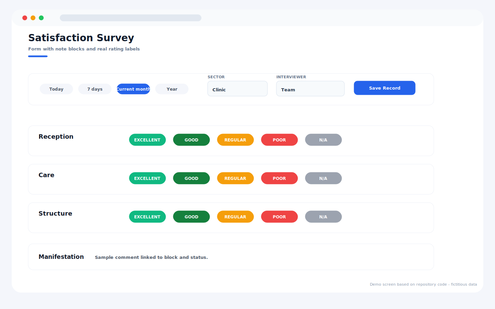
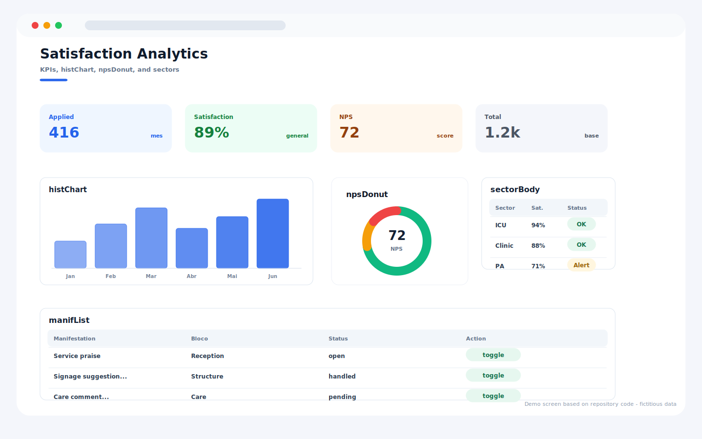
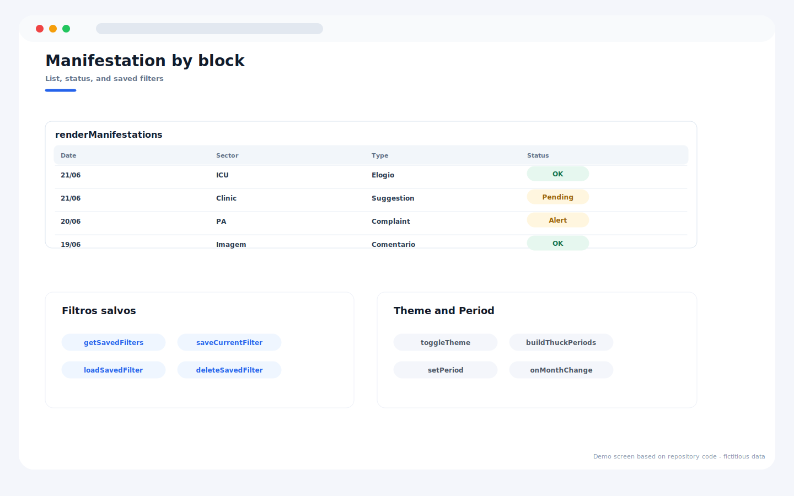

# Patient Satisfaction Survey System

Patient satisfaction survey system designed to collect, organize, and analyze healthcare feedback.

## Overview

This project was developed to solve real operational problems using web technologies and Google Workspace tools.

## Features

- Dashboard interface
- Process automation
- Data organization
- KPI monitoring
- Responsive design
- Google Workspace integration

## Technologies

- JavaScript
- HTML
- CSS
- Google Apps Script
- Google Sheets
- Looker Studio

## Purpose

The goal of this project is to improve operational efficiency, reduce manual work, and support better decision-making through automation and clear data visualization.

## Guia visual do sistema

> Mockups demonstrativos do sistema, com dados ficticios e sem informacoes reais de pacientes ou da instituicao.

### Formulario de pesquisa

### Analise de satisfacao

### Manifestacoes por bloco

## Manifestações por bloco

As manifestações (Sugestões, Reclamações, Comentários, Elogios) existem **dentro de cada bloco**: Acolhimento, Assistência e Serviços.

Ao atualizar uma instância que já tem dados, execute a migração **uma única vez** após publicar o novo código:

1. Cole o novo `Code.gs` e `index.html` no projeto do Apps Script.
2. No editor, selecione a função `migrateToBlockManifestations` e clique em **Executar**.
   - Faz um **backup automático** da aba (`MATRIZ_BACKUP_<data>`) antes de reescrever.
   - Converte textos livres de cada bloco para Comentários do respectivo bloco; manifestações globais antigas vão para o bloco 1 (Acolhimento), concatenando o Comentário do Acolhimento quando necessário.
   - É segura para reexecução: detecta se já foi migrada e aborta.
3. Republique o app web.

## Status

Completed